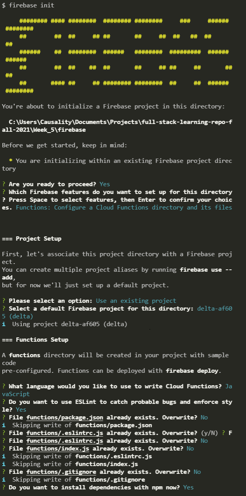

# Week 5: Cloud Functions/Social

# Materials

- [Week 5 Backend Slides](https://docs.google.com/presentation/d/1EZm92RxIgzW_lp8Fx-tmGbDatfm2Q_TtDCE_qx6TM7E/edit?usp=sharing)
- No frontend slides! Please attend the Palantir event! 

# Week 4 Homework Solution

- [Week 4 Backend Homework Solution](https://github.com/tpeo/full-stack-learning-repo-fall-2021/blob/Week_5/Week_4/homework/backend/index_solution.js)
- [Week 4 Frontend Homework Solution](https://codesandbox.io/s/to-do-complete-vrxzf?file=/src/components/Header/Header.js)

# In Class Activity (Backend)

To get y'all more familiar with Firebase hosting, we've added an hosted application on `/firebase` for y'all to inspect.

You'll have to login to firebase with the CLI (command line interface) tool, connect it with a project, and add functions into the project.

1. `cd firebase`
2. `firebase login`
3. `firebase init`

4. Add your credentials json file as `cred.json` under `functions/`
5. Nagivate to `functions/index.js` and update `databaseURL: "ENTER_URL_DATABASE"`

To run and debug the functions locally ...

1. Run `firebase emulators:start --only functions`

To deploy the functions to your cloud ...

1. Run `firebase deploy --only functions`

For more information visit the [Firebase Website](https://firebase.google.com/docs/hosting/test-preview-deploy)

# Homework
If you have not completed the in-class activity for the backend class, please complete it as homework. We are reaching the midpoint of the course, so please [fill out the this survey to help us improve the class in the future!](https://docs.google.com/forms/d/e/1FAIpQLSd0_nwS1k-JYjLmUDY2hWe2qswObU3ZzwXQuPULE0W9NmPnZQ/viewform?usp=sf_link) 

In addition, *engineering fellows please share the link to your personal GitHub repository for this class on Slack by this Saturday evening.* We will begin grading your existing homework, so please take this week to complete any homework that you have not yet finished! 

This week's activity will have some connection to last week as you are still writing your ExpressJS REST API, but instead of using a JSON object as a database, we'll be connecting to Firebase and more specifically, Firestore.

Like last week, we're still dealing with a user database with name and age. Additionally, we have already written two functions for you (GET all users and CREATE a new user). **We want you to extend the functionality of the API by writing an API endpoint to query users in the database, returning users whose age is above a certain query value.**

Some questions to consider before starting this assignment:

- What type of request should this be (GET,POST, PUT, etc)?
- How should I get the age (query param, body, etc)?

## Instructions

Make sure you have a firebase account and created a project with the Firestore database checked

1. Download and save a private credential key by navigating towards your project dashboard -> settings -> service accounts -> generate private key
2. Store your private key in an environment variable, json, etc

Make sure you have a text editor installed on your machine.

1. Open your text editor of choice inside the homework/backend directory.
2. Open the terminal in the homework/frontend directory and run `npm install` to install dependencies.
3. Once all the dependencies are installed, run the application by running `npm run dev`. A message with `Listening on Port 4000` should appear.
4. Write code for index.js that will meet the requirements.
5. Save the completed site.
6. Once done, save and push your code to the forked repository.

## Requirements

- A function that returns users in the firestore database over a queried age
- Optional: write the PUT and DELETE methods for users using the Firestore/Firebase SDK
- Optional: connect the Express app to a firebase project and host it on Firebase Functions

## Things to Google

Good engineers know how to learn on their own. Here are a couple of topics that might be helpful to Google based on this week's lesson:

- Firebase Firestore expressJS SDK
- AWS Lambda Serverless
- Containerization vs Virtualization
- Dev Ops
